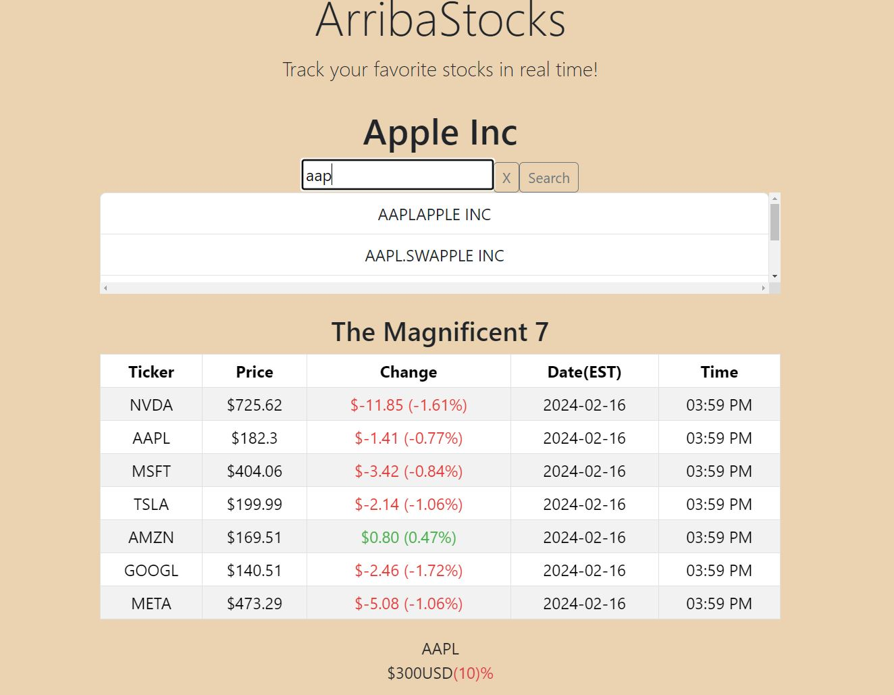

# ArribaStocks [](https://opensource.org/licenses/)

Empower your investment journey with Arriba Stocks, an application for investors who need to monitor real-time stock prices.

[ArribaStocks Deployed Application Link](https://sarahsquyres.github.io/arribaStocks/)

## Table of Contents

* [Description](#description)
* [App Preview](#app-preview)
* [Getting Started](#getting-started)
* [Dependencies and Tech Stack](#dependencies-and-tech-stack)
* [Installing](#installing)
* [Executing Program](#executing-program)
* [Authors](#Authors)
* [License](#license)
* [Acknowledgments](#acknowledgments)

## Description

With ArribaStocks, users can search for the stocks they are interested in and retrieve up-to-the-minute information on the day's price action, day change, and percent change.  They also have a continuous view of the Magnificent 7 stocks to keep an eye on the overall market.

## App Preview

Application Preview

## Getting Started

### Dependencies and Tech Stack

* [Bootstrap](https://getbootstrap.com/): for styling
* [IEX Cloud API](https://iexcloud.io/): to retrieve minute-by-minute data
* [Finnhub API](https://finnhub.io/): stock search
* React
* JavaScript

### Installing

* To install dependencies:
```
npm install
```

### Executing program

* To run the program execute following command:
```
npm start
```

## Authors

Contributors names and contact info

Sarah Squyres  
GitHub: https://github.com/SarahSquyres 

## License

This project is licensed under the MIT License - see the LICENSE.md file for details

## Acknowledgments

Inspiration, code snippets, etc.
* [Great Walkthrough for IEX Cloud](https://www.youtube.com/watch?v=onSKOD3RPo8&list=PLjItgYqIzJ9VOBgwZ82D9kjQ_QtM5R4u5)
* [Greath Walkthrough for Finnhub and Functionality](https://www.youtube.com/playlist?list=PLJN4kg0Hkqi2fu6ifNAkw9TLwTOH-e0-K)
* [Gemini AI](https://gemini.google.com/app)
* [How to Create a Scrolling Ticker](https://www.youtube.com/watch?v=bZ872X-ghfI)


